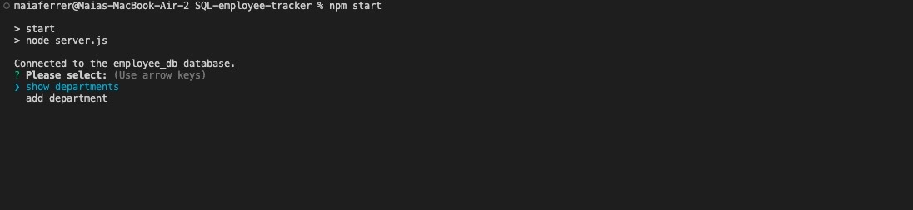

# SQL-employee-tracker

[](https://github.com/Naereen/StrapDown.js/blob/master/LICENSE)



## Project Description

the start to a command-line application from scratch to manage a company's employee database, using Node.js, Inquirer, and MySQL.

Check out the Demo [HERE](https://youtu.be/SBauB6hp92g) !

## Installation & Usage

1. User must first install the `inquierer` using the following command in the integrated terminal:
   `npm i inquirer`

2. The server will then be invoked using the following command:
   `npm start`

## User Story

```
AS A business owner
I WANT to be able to view and manage the departments, roles, and employees in my company
SO THAT I can organize and plan my business

```

## Important Links

- [GitHub Repository](https://github.com/maiaferrer/SQL-employee-tracker)
- [Demo](https://youtu.be/SBauB6hp92g)

## Technology used


## Contact Me

For further quesitons contact me at: maiaferrer604@gmail.com or
[Github](https://github.com/maiaferrer) or
[Linkedin](https://www.linkedin.com/in/maia-f-2b7aa710a)
